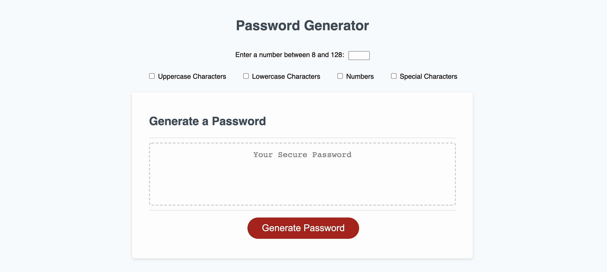

# Password Generator

## Description

With this page, users can create a random password using a set of four parameters. As longer passwords and passwords with a variety of different characters are more secure and less likely to be guessed, I wanted users to be able to easily create such passwords with only a few prompts.

## Installation

There is no installation required to use this webpage.

## Usage

By clicking on the Generate Password button, users will be prompted to choose certain specifications about their password, including length and which characters they would like included (i.e., uppercase, lowercase, numbers, and special).

In addition, if the length they select is too short or too long, or if they decline use of all types of characters, they will be prompted to try again.

After a password is created, it will appear in the text box in the middle of the page, where the user can easily copy the password to their clipboard.

## Features

While this simple page has no break points, its simple design will display nicely across almost any screen size.

## Credits

Jeff DeRosalia, Dan Rosenbaum

## Link

https://ryanascherr.github.io/password-generator/
